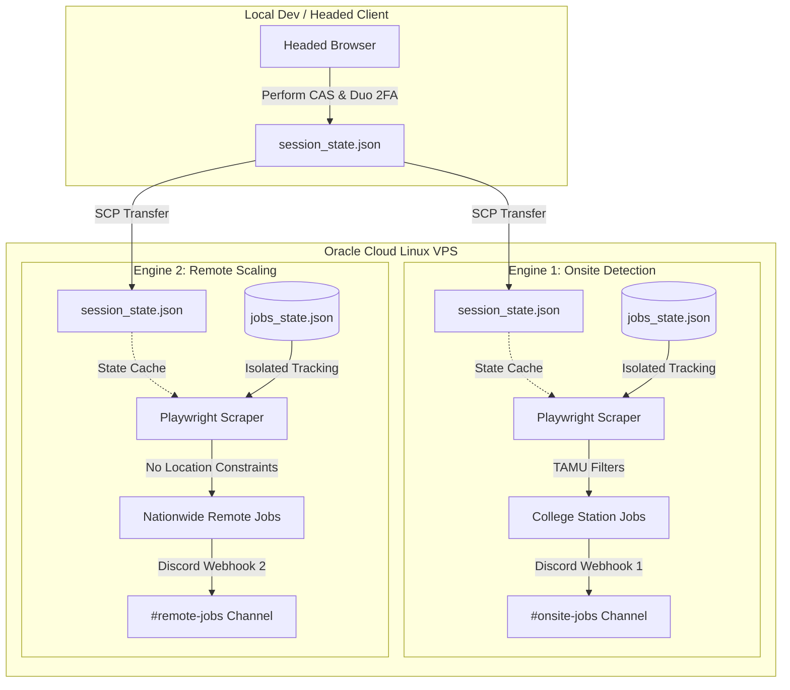

#  Aggie Job Notifier

An autonomous, cloud-native background pipeline linking Symplicity job board telemetry directly to isolated Discord streaming environments. Designed for Texas A&M students to scrape and filter job listings, bypass Duo MFA seamlessly on headless instances, and broadcast real-time embeds to target channels.

---

## 💻 Local Desktop Quick Start (No Code Required)

For students who want to run the notifier on their own Windows PC without setting up code or cloud environments:

### 1 — Download & Extract
1. Download this repository as a ZIP file (click the green **Code** button at the top right, then **Download ZIP**).
2. Extract the ZIP file to a folder on your computer (e.g., your Desktop).

### 2 — Launch the Application
Double-click **[AggieJobNotifier.exe](file:///c:/Users/juanp/Desktop/JobsforAggiesNotifier/AggieJobNotifier.exe)** in the folder. A dark-mode desktop configuration window will open.

### 3 — Configure Your Settings
Configure your settings in the left panel of the desktop window:
* **TAMU NetID**: Your full TAMU email address (e.g., `netid@tamu.edu`).
* **TAMU Password**: Your TAMU login password.
* **Discord Webhook URL**: The webhook URL of the Discord channel where you want to receive alerts (configured in Discord via *Channel Settings → Integrations → Webhooks*).
* **Run Interval (minutes)**: How often the bot checks for new jobs (default: `60` minutes).
* **Title Keywords**: Comma-separated list of roles you want to search for (e.g., `Developer, Software, IT Support, Assistant`). Leave empty to get notified for **all** matching jobs.
* **Filters**: Check any checkboxes for remote/onsite, job types, campus location, or work authorization limits to filter results.

### 4 — Start the Scraper
Click the **▶ Start** button. 
* **First-time Login (Duo 2FA)**: On your first run, a visible browser window will pop up. Enter your NetID/password if prompted and **approve the Duo push on your phone**.
* Once approved, the application saves a secure login session (`session_state.json`) and restarts in **headless (hidden) mode**. From this point forward, you won't need to approve Duo again unless the session expires (usually once a week).

### 📅 Run Automatically on Windows Startup
To make the notifier run automatically every time you turn on your computer:
1. Press `Win + R`, type `shell:startup`, and press Enter. This opens your Windows **Startup** folder.
2. Right-click [AggieJobNotifier.exe](file:///c:/Users/juanp/Desktop/JobsforAggiesNotifier/AggieJobNotifier.exe), select **Create shortcut**, and drag that shortcut into the Startup folder.
3. The notifier will now launch automatically in the background whenever you log in to Windows!

---

## 🏗️ System Architecture

The platform is designed to deploy in a **Dual-Engine Deployment** configuration, running concurrently on a remote Linux server (such as an Oracle Cloud Free Tier Linux VPS). This enables simultaneous tracking of localized, on-campus student employment and nationwide remote software engineering internships.



### Dual-Engine Configurations
1. **Onsite Detection Engine**
   * **Target**: On-campus jobs, teaching assistantships, grader positions, and research roles.
   * **Filters**: Locked to College Station campus (`school = ["0010"]` or location-constrained to `College Station`).
   * **Destination**: Direct pipeline to `#onsite-jobs` Discord channel.
2. **Remote Scaling Engine**
   * **Target**: Remote internships, co-ops, and software development positions.
   * **Filters**: Location constraints stripped (`LOCATION_FILTER = []` or configured specifically for `Remote`).
   * **Destination**: Direct pipeline to `#remote-jobs` Discord channel.

### State & Execution Isolation
To prevent tracking collisions, state pollution, or race conditions, each engine operates within its own **isolated workspace folder** on the cloud VPS (e.g., `~/aggie-notifier-onsite` and `~/aggie-notifier-remote`). Each directory holds its own local configuration (`.env` / `config.py`), local browser session cookies (`session_state.json`), and unique tracker history database (`jobs_state.json`).

---

## ⚡ Advanced Features

### 🔑 MFA / Duo 2FA Bypass Framework
Because Texas A&M implements strict single sign-on (SSO) backed by Duo Multi-Factor Authentication, standard automated scripts struggle on headless servers. This architecture solves this via a session serialization handshake:
1. **Local Initialization (Headed)**: Run the script locally on a machine with a display environment. The scraper spins up a headed Chromium browser.
2. **Active Authentication**: The user performs the credential entry and approves the interactive Duo 2FA push notification on their mobile device.
3. **Session Capture**: Playwright serializes the authenticated cookies, tokens, and localStorage values directly into a local state file: `session_state.json`.
4. **Cloud Migration**: This secure state file is securely transferred via SCP to the remote headless Linux server. The remote scraper restores the exact browser context directly from the cache file, bypassing SSO and Duo 2FA authentication entirely.

### 🌐 API Interception Layer
The scraper avoids noisy, fragile page-scraping wherever possible by tapping directly into the Symplicity SPA data stream:
* **Network Sniffing**: Using Playwright's network event listeners, the script monitors all background XHR/fetch traffic during SPA page loads.
* **JSON Extraction**: It intercepts raw response payloads matching `/csm/api/v[12]/jobs` endpoints, extracting rich, clean structured JSON data (including hidden metadata fields like academic level restrictions).
* **Fallback DOM Parser**: If the API path changes or network traffic interception fails, the scraper gracefully falls back to a DOM-parsing heuristic engine that scans individual page cards (`[data-automation='jobResult']`), extracting details from rendered selectors.

### 🛰️ Data Isolation & Discord Routing
The pipeline formats job entries into custom, rich Discord Embeds. By separating the engines into distinct directories, they read separate Webhook URLs from their respective `.env` files. This routes onsite opportunities to your `#onsite-jobs` channel, and remote postings to `#remote-jobs`, avoiding feed spam.

---

## 🚀 Production Deployment Guide

Follow this walkthrough to configure and run the dual-engine pipeline on an Oracle Cloud Linux VPS (or any remote Debian/Ubuntu-based server).

### Step 1: Duplicate Workspace Directories
Create isolated workspaces for both engines on your VPS:
```bash
# Create directory structures
mkdir -p ~/aggie-notifier-onsite
mkdir -p ~/aggie-notifier-remote
```
Upload the code files (`main.py`, `config.py`, `requirements.txt`, etc.) into both folders.

### Step 2: Initialize Virtual Environments & Playwright
For each engine folder, initialize a Python virtual environment and install dependencies along with the Playwright browser binaries:

**For Onsite Engine:**
```bash
cd ~/aggie-notifier-onsite
python3 -m venv .venv
source .venv/bin/activate
pip install -r requirements.txt
playwright install chromium --with-deps
deactivate
```

**For Remote Engine:**
```bash
cd ~/aggie-notifier-remote
python3 -m venv .venv
source .venv/bin/activate
pip install -r requirements.txt
playwright install chromium --with-deps
deactivate
```

### Step 3: Configure Environment Settings
Create a `.env` file in each directory.

* In `~/aggie-notifier-onsite/.env`:
  ```ini
  TAMU_USERNAME="your_netid@tamu.edu"
  TAMU_PASSWORD="your_password"
  DISCORD_WEBHOOK_URL="https://discord.com/api/webhooks/YOUR_ONSITE_CHANNEL_WEBHOOK"
  ```
  *(In `~/aggie-notifier-onsite/config.py`, ensure `LOCATION_FILTER` is set to `["College Station"]` or `FILTERS["school"] = ["0010"]`)*

* In `~/aggie-notifier-remote/.env`:
  ```ini
  TAMU_USERNAME="your_netid@tamu.edu"
  TAMU_PASSWORD="your_password"
  DISCORD_WEBHOOK_URL="https://discord.com/api/webhooks/YOUR_REMOTE_CHANNEL_WEBHOOK"
  ```
  *(In `~/aggie-notifier-remote/config.py`, clear the location constraints so that `LOCATION_FILTER = []`)*

### Step 4: Generate and Push MFA Session Cache
Generate the Duo 2FA session cache on your local (headed) machine:
```bash
# On your local machine (within repository folder)
python main.py --login
```
Complete the Duo 2FA push on your phone. Once the script finishes saving the state, transfer the session to both cloud paths:
```bash
# Push to the onsite workspace
scp session_state.json user@YOUR_VPS_IP:~/aggie-notifier-onsite/session_state.json

# Push to the remote workspace
scp session_state.json user@YOUR_VPS_IP:~/aggie-notifier-remote/session_state.json
```

### Step 5: Launch background loops via TMUX
Use `tmux` to run both scrapers concurrently in background sessions that persist after you log out of SSH.

**Start the Onsite Engine:**
```bash
# Create a new named tmux session
tmux new -s notifier-onsite

# Within the tmux session, start the scraper in continuous daemon mode
cd ~/aggie-notifier-onsite
source .venv/bin/activate
python main.py --continuous

# Detach from the session: Press Ctrl+B, then D
```

**Start the Remote Engine:**
```bash
# Create a second named tmux session
tmux new -s notifier-remote

# Within the tmux session, start the remote scraper in continuous daemon mode
cd ~/aggie-notifier-remote
source .venv/bin/activate
python main.py --continuous

# Detach from the session: Press Ctrl+B, then D
```

### Useful TMUX Control Commands
* **List active sessions**: `tmux ls`
* **Attach to a running session**: `tmux attach -t notifier-onsite`
* **Kill/Stop a session**: `tmux kill-session -t notifier-onsite`

---

## 🔒 Security & Data Hygiene Notice

> [!WARNING]
> **CRITICAL SECURITY RISK: NEVER PUBLISH YOUR CREDENTIALS OR ACTIVE SESSIONS!**
> 
> * **`.env`** contains your raw TAMU NetID credentials and SSO passwords.
> * **`session_state.json`** contains active, unexpired authentication cookies and storage state keys that grant direct access to your TAMU student account, bypassing Duo 2FA.
> 
> Ensure your local and remote repositories strictly enforce the `.gitignore` settings:
> ```git
> # Secrets — never commit these
> .env
> session_state.json
> 
> # State & Runtime outputs
> jobs_state.json
> *.log
> ```
> Regularly monitor git status before pushing commits to verify that no live credentials or state variables slip into public code repositories.

---
*Built with ❤️ for Aggies.*
